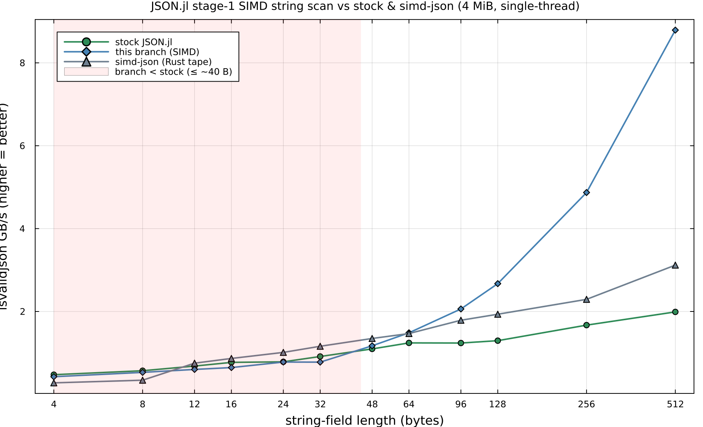

# Stage-1 SIMD string scanner — size-sweep benchmark

Reference numbers for the `strictmode-simd-stage1` branch: `parsestring`'s byte-by-byte scan for the
end of a string is replaced by a SIMD classifier (`Vec{64,UInt8}` → `<64 x i8>` AVX-512 `vpcmpb` + mask)
for long strings, while keeping the original scalar loop for the common short-string case.

**Metric:** `JSON.isvalidjson(bytes)` throughput (GB/s) — a full structural pass that exercises
`parsestring` heavily, with zero output allocation (so the number is the parse work, not GC). Documents
are 4 MiB arrays of `{id, a, b, c}` records whose three string fields are each exactly `strlen` bytes
(uniform `a–z`, no escapes), regenerated deterministically per size.

**Setup:** single-thread, `julia -O3 -t1`, `taskset -c 4` (SMT sibling idle), `RAYON_NUM_THREADS=1`,
median of 400 reps with `GC.gc()` between and a DCE sink. `simd-json` = the Rust crate's `to_tape`
(via the BlazingPorts `bp_simdjson_parse` shim) on the *same* bytes — it must copy the input first (it
unescapes in place), which is ~1% of its time. Machine: Zen5; this run pinned to a quiet core (`taskset
-c 11`) for low noise rather than a peak-boost core, so absolute GB/s is conservative but the three-way
comparison is clean. Reproduce with [`string_scan_bench.jl`](string_scan_bench.jl).

(Regenerate the plot from the saved data with [`plot_string_scan.jl`](plot_string_scan.jl).)

## Results

Each of the three "GB/s" columns is an **absolute throughput** (document bytes ÷ median parse time,
**higher = better**) — they are independent measurements, *not* ratios of each other. The two `×`
columns *are* ratios, computed from those GB/s (`<1` = the branch is slower, `>1` = faster). Numbers are
a clean same-core run (core 11, σ ≤ 8% except where noted); absolute GB/s is lower than a boosted core,
but the branch/stock/simd-json comparison is apples-to-apples.

| string len (B) | stock JSON.jl (GB/s) | this branch (GB/s) | simd-json (GB/s) | branch ÷ stock | branch ÷ simd-json |
|---------------:|---------------------:|-------------------:|-----------------:|---------------:|-------------------:|
|   4 | 0.475 | 0.426 | 0.278 | 0.90× | **1.53×** |
|   8 | 0.571 | 0.531 | 0.342 | 0.93× | **1.55×** |
|  12 | 0.683 | 0.602 | 0.753 | 0.88× | 0.80× |
|  16 | 0.772 | 0.647 | 0.867 | **0.84×** | 0.75× |
|  24 | 0.786 | 0.780 | 1.013 | 0.99×¹ | 0.77× |
|  32 | 0.914 | 0.778 | 1.161 | **0.85×** | 0.67× |
|  48 | 1.097 | 1.172 | 1.349 | **1.07×** | 0.87× |
|  64 | 1.242 | 1.486 | 1.468 | 1.20× | 1.01× |
|  96 | 1.239 | 2.061 | 1.789 | 1.66× | 1.15× |
| 128 | 1.296 | 2.672 | 1.934 | 2.06× | 1.38× |
| 256 | 1.671 | 4.871 | 2.293 | 2.92× | 2.12× |
| 512 | 1.990 | 8.790 | 3.119 | **4.42×** | 2.82× |

¹ stock σ=14% at L=24; treat that ratio as noisy.

## Reading the curve

- **Long strings (≥ 48 B): a growing win.** The branch overtakes stock at ~48 B and reaches **4.4×
  stock / 2.8× simd-json at 512 B** — the SIMD classifier scans content at memory-bandwidth speed while
  the scalar loop plods byte-by-byte. This is the regime the change is for (text blobs, base64, long
  descriptions, embedded documents).
- **Short/medium strings (≤ 32 B): a ~10–16 % regression**, deepest (~16 %) around 16–32 B. Even
  4–8 B strings are ~7–10 % slower (the branch still beats simd-json there, whose fixed per-document
  tape overhead dominates on tiny records — but that's a comparison to Rust, not to stock JSON.jl).
- **Root cause (from `code_native`, not the noisy timings):** adding the SIMD path makes `parsestring`'s
  string loop bigger and changes its shape. The original cold-`@noinline`-call design was worse — the
  call made `parsestring` *non-leaf*, forcing 5 callee-saved push/pops per string and ~doubling the loop
  (26 → 50 instructions). **Inlining the scan** (this branch) removes the call so `parsestring` stays a
  leaf (which is why the bottom is ~16 % here, not ~24 %, and the stock cross-over moved from ~64 B to
  ~48 B), but the inline `Vec{64,UInt8}` scan + scalar-window logic still makes the function ~3× the
  instruction count of stock's minimal tight loop. That residual size is the remaining short/medium tax;
  ≥48 B the SIMD throughput outweighs it.

**Net:** a strong, growing win for strings ≥ 48 B, and a ~10–16 % tax for strings ≤ 32 B. Whether the
trade is worth it depends on the workload — string-heavy/long-field JSON (descriptions, text, base64,
embedded blobs) benefits a lot; JSON that is overwhelmingly short keys/values regresses. **Remaining
lever:** the short/medium tax is now purely the *size* of the inlined scan (parsestring is ~3× stock's
instruction count). Shrinking it — a smaller/branchless scalar window, or only compiling the SIMD path
in for buffer types where it pays — would narrow the tax further without losing the long-string win.

## Caveats

- `isvalidjson` validates structure; it does not build a Julia value graph. Full `JSON.parse` adds the
  same allocation on both sides, so the *relative* picture holds but absolute GB/s is lower and GC-noisier.
- `simd-json` builds a usable tape; `isvalidjson` does not — so the simd-json column is a generous
  comparison (it does strictly more work), which makes the branch's ≥ 96 B lead the more notable.
- Numbers are single-core; none of the three uses threads here.
